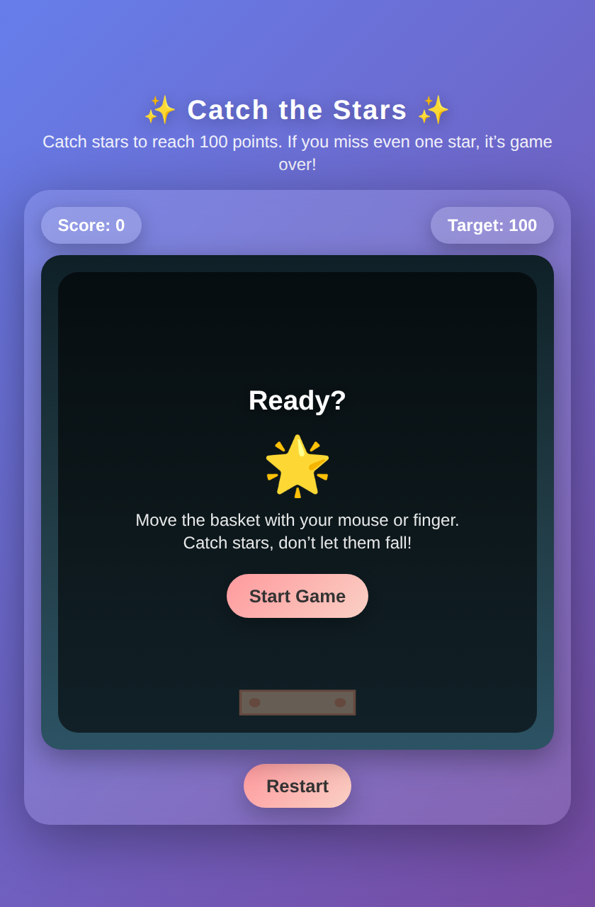

 Catch the Stars is a simple, browser-based arcade mini-game built completely with HTML and CSS, developed using AI prompt engineering as a beginner project.

 

## About the Project
**Catch the Stars** is an interactive web game built entirely using pure HTML and CSS. As a beginner exploring web development and AI-assisted programming, I designed and developed this project using AI prompt engineering to generate the core code structure and visual styling without external dependencies.
 
### Highlights
* **Zero Dependencies**: Built purely with HTML and CSS.
* **AI-Assisted Development**: Coded by creating structured prompts with AI tools.
* **Beginner Friendly**: Lightweight, easy to run locally, and fully accessible in any modern web browser.
